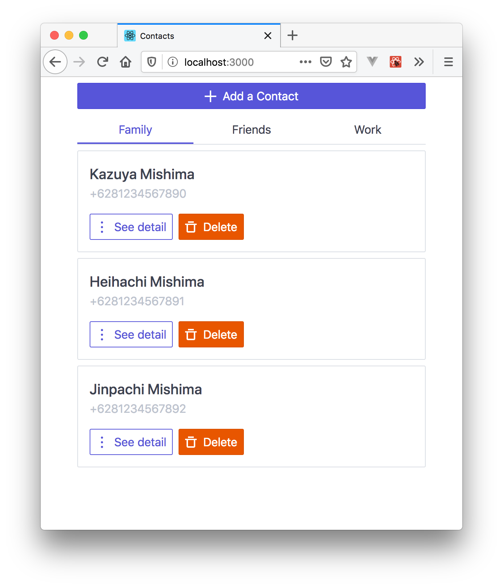
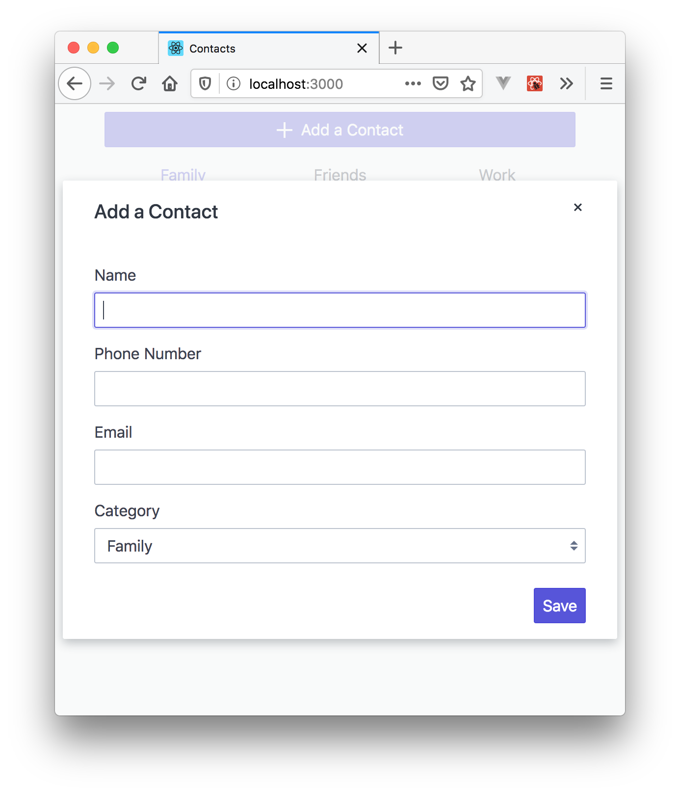
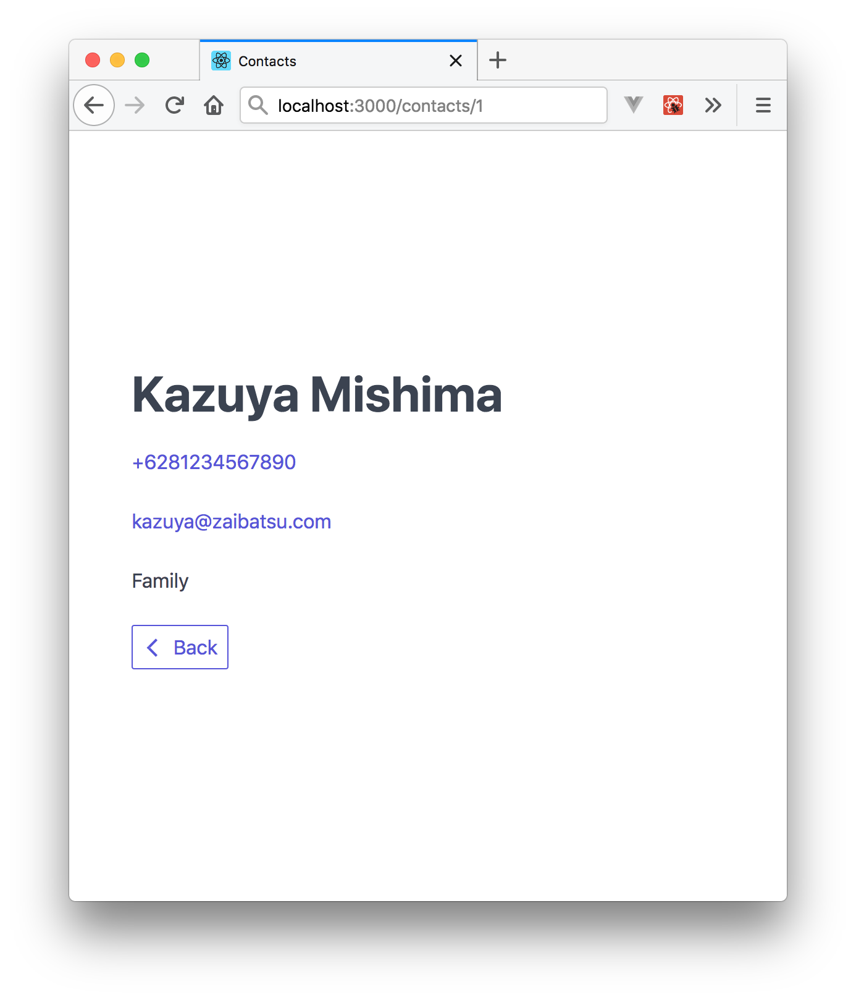

# Contacts App

## Summary

Buatlah aplikasi Contacts menggunakan React. Dalam aplikasi ini, terdapat tiga
kategori kontak yaitu: `Family`, `Friends` dan `Work`. User bisa melihat siapa
saja kontak yang dimiliki berdasarkan kategori yang dipilih. Silakan menggunakan
`json-server` untuk menyingkat waktu!

Skema dari kontak adalah sebagai berikut:
```json
{
  "id": 1,
  "name": "",
  "phoneNumber": "",
  "email": "",
  "category": ""
}
```

## Competencies

- React
- React Router
- Redux


## Release 0

Buatlah sebuah halaman dengan path `/` yang menampilkan data kontak yang
berkategori `Family`. Di setiap item-nya, tambahkan button `See detail` dan
`Delete`.



## Release 1

Buatlah sebuah form untuk menambahkan kontak, boleh dibuat menggunakan modal
atau membuat route baru. Data yang bisa di-input oleh user adalah `Name`, `Phone
Number`, `Email` serta `Category`.



## Release 2

Implementasikan `Delete` button untuk menghapus kontak.

## Release 3

Implementasikan `See detail` button, buatlah halaman detail dengan path
`/contacts/:id` yang menampilkan detail dari kontak yang dipilih.



## Release 4

Buatlah path `/friends` dan `/work` untuk menampilkan kontak yang berkategori
`Friends` dan `Work`.
